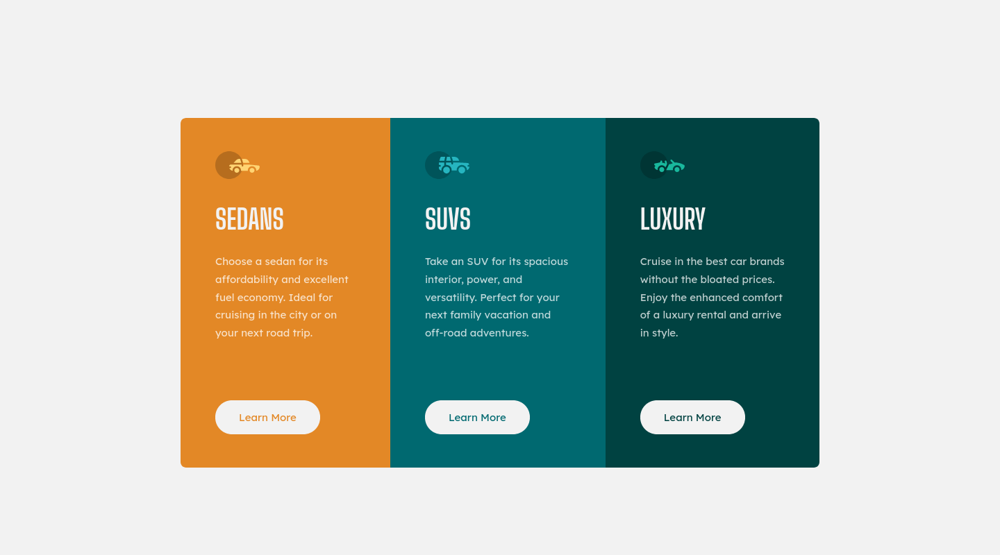

# Frontend Mentor - 3-column preview card component solution

This is a solution to the [3-column preview card component challenge on Frontend Mentor](https://www.frontendmentor.io/challenges/3column-preview-card-component-pH92eAR2-). Frontend Mentor challenges help you improve your coding skills by building realistic projects.

## Table of contents

- [Overview](#overview)
  - [The challenge](#the-challenge)
  - [Screenshot](#screenshot)
  - [Links](#links)
- [My process](#my-process)
  - [Built with](#built-with)
  - [What I learned](#what-i-learned)
  - [Continued development](#continued-development)
- [Author](#author)

## Overview

### The challenge

Users should be able to:

- View the optimal layout depending on their device's screen size
- See hover states for interactive elements

### Screenshot



### Links

- Solution URL: [Github Repo](https://github.com/xolott/fm-3-column-preview-card-component)
- Live Site URL: [Add live site URL here](https://your-live-site-url.com)

## My process

### Built with

- Semantic HTML5 markup
- CSS custom properties
- Flexbox
- Mobile-first workflow
- [React](https://reactjs.org/) - JS library
- [Styled Components](https://styled-components.com/) - For styles

### What I learned

I put in practice the Theme features of Styled Components. Been able to create a theme object like this, made my code more clean:

```js
const theme = {
  heading: {
    color: "hsl(0, 0%, 95%)",
    font: "Big Shoulders Display",
  },
  button: {
    background: "hsl(0, 0%, 95%)",
    font: "Lexend Deca",
  },
  text: {
    color: "hsla(0, 0%, 100%, 0.75)",
    font: "Lexend Deca",
  },
  color: {
    body: "hsl(0, 0%, 95%)",
    primary: {
      orange: "hsl(31, 77%, 52%)",
      darkCyan: "hsl(184, 100%, 22%)",
      veryDarkCyan: "hsl(179, 100%, 13%)",
    },
  },
};
```

### Continued development

This was a great opportunity to practice my skills using Semantic HTML, but I feel that there is a huge room for improvement

## Author

- Website - [Personal Website](https://truyol.dev)
- Frontend Mentor - [@xolott](https://www.frontendmentor.io/profile/xolott)
- Twitter - [@xolott](https://www.twitter.com/xolott)
